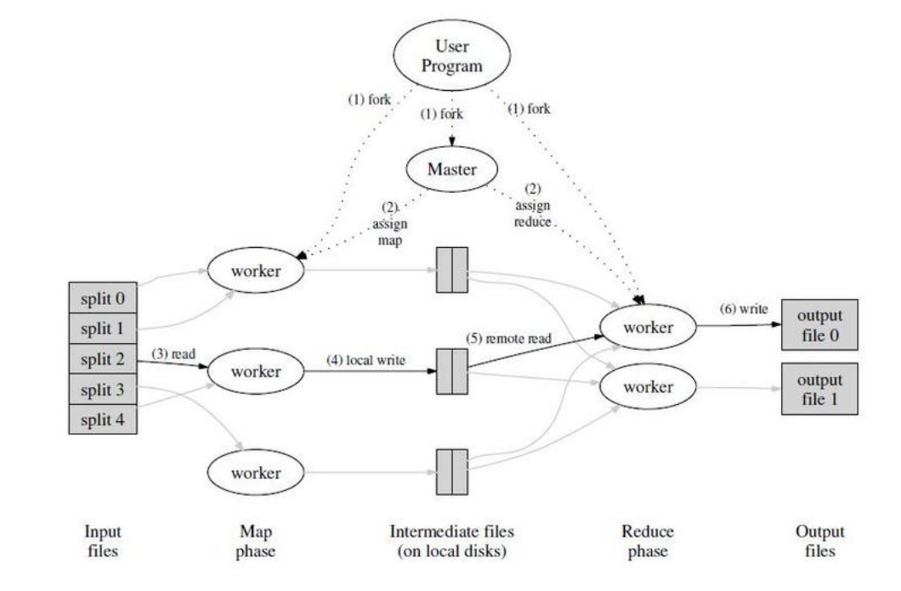

# MapReduce
## 1. MapReduce的概念
### 1.1 分布式系统的概念
分布式系统的优点：性能高，容错性强

分布式系统的挑战：复杂的交互，局部性错误，以及性能的提升方法

分布式系统基础架构的类型：存储，通信（网络），计算

### 1.2 分布式系统的扩展性
可扩展或者可扩展性指的是，随着系统中计算机的数量增加，性能也会相应地提升，例如计算机数量增加一倍，那么性能也会翻倍。

但是这种可扩展性并不是无限的。很可能在某个时间点你有了10台，20台，甚至100台web服务器，性能却没有什么提升，因为当前分布式系统中的计算机数量不再是性能瓶颈，而是其它部分成为了瓶颈，因此增加更多的web服务器都无济于事了。

### 1.3 分布式系统的可用性
可用性也就是容错性。大型分布式系统中有一个大问题，那就是一些很罕见的问题会被放大。虽然单台计算机故障的概率很小，但是在大的集群中，总是会有故障的计算机存在。

所以，因为错误总会发生，必须要在设计时就考虑，系统能够屏蔽错误，或者说能够在出错时继续运行。同时，因为我们需要为第三方应用开发人员提供方便的抽象接口，我们的确也需要构建这样一种基础架构，它能够尽可能多的对应用开发人员屏蔽和掩盖错误。

另一种容错特性是自我可恢复性（recoverability）。可恢复性是指，如果出现了问题，服务会停止工作，不再响应请求，之后有人来修复，并且在修复之后系统仍然可以正常运行，就像没有出现过问题一样。

实现容错性和可恢复性的两个工具：
- 非易失存储，类似于硬盘；
- 通过复制建立多副本系统。

### 1.4 分布式系统的一致性
一致性的目的在于，从分布式系统的不同节点上，同样的输入可以获得同样的结果，并且是得到最近一次完成的put请求写入的值。

要理解一致性，这里有个例子，假设我们在构建一个分布式存储系统，并且这是一个KV服务。这个KV服务只支持两种操作，其中一个是put操作会将一个value存入一个key；另一个是get操作会取出key对应的value。

- 强一致性：get请求一定可以得到最近一次完成的put请求写入的值，但它对同步的要求很高，系统需要牺牲大量性能去维持强一致性。
- 弱一致性：人们常常会使用弱一致系统，它只需要更新最近的数据副本，并且只需要从最近的副本获取数据，它不绝对保证get请求可以得到最近一次完成的put请求写入的值。弱一致性可以获得很好的性能。

## 2. MapReduce分布式系统
### 2.1 MapReduce的基本思路
用户自定义的Map函数接受一个输入的key/value pair值，然后产生一个中间key/value pair值的集合。MapReduce库把所有具有相同中间key值x的中间value值集合在一起后传递给reduce函数；

用户自定义的Reduce函数接受一个中间key的值x和相关的一个value值的集合。Reduce函数合并这些value值，形成一个较小的value值的集合。一般的，每次Reduce函数调用只产生0或1个输出value值。通常我们通过一个迭代器把中间value值提供给Reduce函数，这样我们就可以处理无法全部放入内存中的大量的value值的集合。

也就是说，Map负责将原始的key-value集合映射成另一个key-value集合（称为中间数据），再由Reduce进行进一步处理。

### 2.2 使用MapReduce的例子
一些任务的处理可以使用MapReduce模型：
- 分布式的Grep：Map函数输出匹配某个模式的一行，Reduce函数是一个恒等函数，即把中间数据 复制到输出。
- 计算URL访问频率：Map函数处理日志中web页面请求的记录，然后输出(URL,1)。Reduce函数把相同URL的value值都累加起来，产生(URL,记录总数)结果。
- 倒转网络链接图：Map函数在源页面（source）中搜索所有的链接目标（target）并输出为(target,source)。Reduce函数把给定链接目标（target）的链接组合成一个列表，输出(target,list(source))。

另外，MapReduce常常被分布到多台机器上执行。通过将Map调用的输入数据自动分割为M个数据片段的集合，Map调用被分布到多台机器上执行。输入的数据片段能够在不同的机器上并行处理。使用分区函数将Map调用产生的中间key值分成R个不同分区（例如，hash(key) mod R），Reduce调用也被分布到多台机器上执行。分区数量（R）和分区函数由用户来指定。

## 3. MapReduce的使用
### 3.1 MapReduce的执行流程

1. 用户程序首先调用的MapReduce库将输入文件分成M个数据片段（split 0~split 4），然后用户程序在机群中创建大量的程序副本，也就是多个worker一个master； 
   
2. 这些程序副本中的有一个特殊的程序master。副本中其它的程序都是worker程序，由master分配任务。有M个Map任务和R个Reduce任务将被分配，master将一个Map任务或一个Reduce任务分配给一个空闲的worker；
3. 被分配了map任务的worker程序读取相关的输入数据片段，从输入的数据片段中解析出key/value pair，然后把key/value pair传递给用户自定义的Map函数，由Map函数生成并输出的中间key/value pair，并缓存在内存中；
4. 缓存中的key/value pair通过分区函数分成R个区域，之后周期性的写入到本地磁盘上。缓存的key/value pair在本地磁盘上的存储位置将被回传给master，由master负责把这些存储位置再传送给Reduce worker；
5. 当Reduce worker程序(比如第r个reduce worker)接收到master程序发来的数据存储位置信息后，使用RPC（远程程序控制）从Map worker所在主机的磁盘上读取自己对应的第r个分区缓存数据。当Reduce worker读取了所有的中间数据后，通过对key进行排序后使得具有相同key值的数据聚合在一起。注意，这里reduce worker并不读取map worker的所有数据，map worker上的数据分成R份，reduce worker只读取自己的第r个分区的数据；
6. 接下来需要调用Reduce worker中的Reduce函数。Reduce worker程序遍历排序后的中间数据，对于每一个唯一的中间key值，Reduce worker程序将这个key值和它相关的中间value值集合传递给用户自定义的Reduce函数，Reduce函数处理并产生输出文件。MapReduce的输出存放在R个输出文件中，也就是每个Reduce worker产生一个输出文件，文件名由用户指定；
7. 最终输出文件存储在全局存储系统上。当所有的Map和Reduce任务都完成之后，master唤醒用户程序。在这个时候，在用户程序里的对MapReduce调用才返回。

这里将map拆分成M个片段，reduce拆分成R个片段来分布式地执行。

### 3.2 MapReduce的容错机制
1. work故障

    master周期性的ping每个worker。如果在一个约定的时间范围内没有收到worker返回的信息，master将把这个worker标记为失效。
    
    对于map来说，失效的worker机器的执行和输出存储都已经失效，所以由这个失效的worker正在运行或者已经完成的Map任务被重设为初始的空闲状态，之后这些任务就可以重新被安排给其他的worker；

    对于reduce来说，正在进程的reduce需要重新执行，而已经完成的Reduce任务的输出存储在全局文件系统上，因此不需要再次执行。

2. master失效
   
   一个简单的解决办法是让master周期性地将Master数据结构写入磁盘，即检查点（checkpoint）。如果这个master任务失效了，可以从最后一个检查点开始启动另一个master进程。然而，由于只有一个master进程，master失效后再恢复是比较麻烦的，因此我们现在的实现是如果master失效，就中止MapReduce运算。客户可以检查到这个状态，并且可以根据需要重新执行MapReduce操作。

### 3.3 MapReduce的存储机制

在我们的计算运行环境中，网络带宽是一个相当匮乏的资源。我们通过尽量把输入数据(由GFS管理)存储在集群中机器的本地磁盘上来节省网络带宽。GFS把每个文件按64MB一个Block分隔，每个Block保存在多台机器上，环境中就存放了多份拷贝(一般是3个拷贝)。

MapReduce的master在调度Map任务时会考虑输入文件的位置信息，尽量将一个Map任务调度在包含相关输入数据拷贝的机器上执行；

如果没有调度到那台机器上，master将尝试在保存有输入数据拷贝的机器附近的机器上执行Map任务(例如，分配到一个和包含输入数据的机器在一个switch里的worker机器上执行)。当在一个足够大的cluster集群上运行大型MapReduce操作的时候，大部分的输入数据都能从本地机器读取，因此消耗非常少的网络带宽。

### 3.4 MapReduce的任务粒度
如前所述，我们把Map拆分成了M个片段、把Reduce拆分成R个片段执行，最后输出R个文件。理想情况下，M和R应当比集群中worker的机器数量要多得多，任务粒度较细。在每台worker机器都执行大量的不同任务能够提高集群的动态的负载均衡能力，并且能够加快故障恢复的速度：失效机器上执行的大量Map任务都可以分布到所有其他的worker机器上去执行。

### 3.5 MapReduce的备用任务进程降低尾延迟
影响一个MapReduce的总执行时间最通常的因素是“落伍者”：在运算过程中，如果有一台机器花了很长的时间才完成最后几个Map或Reduce任务，导致MapReduce操作总的执行时间超过预期，这就是尾延迟过大。

尾延迟过大的原因可能是：如果一个机器的硬盘出了问题，在读取的时候要经常的进行读取纠错操作，导致读取数据的速度从30M/s降低到1M/s。如果cluster的调度系统在这台机器上又调度了其他的任务，由于
CPU、内存、本地硬盘和网络带宽等竞争因素的存在，导致执行MapReduce代码的执行效率更加缓慢。

我们有一个通用的机制来降低尾延迟：当一个MapReduce操作接近完成的时候，master调度备用（backup）任务进程来执行剩下的、处于处理中状态（in-progress）的任务。无论是最初的执行进程、还是备用（backup）任务进程完成了任务，我们都把这个任务标记成为已经完成。这种方法通过增加少量资源的方法，明显提升了执行效率。

### 3.6 MapReduce处理技巧

1. 分区函数
   
   MapReduce的使用者通常会指定Reduce任务和Reduce任务输出文件的数量（R）。我们在中间key上使用分区函数来对数据进行分区，之后再输入到后续任务执行进程。一个缺省的分区函数是使用hash方法(比如，hash(key) mod R)进行分区，hash方法能产生非常平衡的分区。

2. 顺序保证
   
   我们确保在给定的分区中，中间key/value pair数据的处理顺序是按照key值增量顺序处理的。这样的顺序保证对每个分成生成一个有序的输出文件，这对于需要对输出文件按key值随机存取的应用非常有意义，对在排序输出的数据集也很有帮助。

3. combiner函数
   
   在某些情况下，Map函数产生的中间key值的重复数据会占很大的比重，我们可以在map中进行一些reduce的预处理。例如词数统计程序，由于词频率倾向于一个zipf分布(齐夫分布)，每个Map任务将产生成千上万个这样的记录<the,1>。我们允许用户指定一个可选的combiner函数，combiner函数首先在本地将这些记录进行一次合并，然后将合并的结果再通过网络发送给reduce worker。

4. 跳过损坏的记录
   
   有时候，用户程序中的bug导致Map或者Reduce函数在处理某些记录的时候crash掉，MapReduce操作无法顺利完成，惯常的做法是修复bug后再次执行MapReduce操作。我们提供了一种执行模式，在这种模式下，为了保证保证整个处理能继续进行，MapReduce会检测哪些记录导致确定性的crash，并且跳过这些记录不处理。

5. 状态信息
   
   master使用嵌入式的HTTP服务器（如Jetty）显示一组状态信息页面，用户可以监控各种执行状态。
   
   状态信息页面显示了包括计算执行的进度，比如已经完成了多少任务、有多少任务正在处理、输入的字节数、中间数据的字节数、输出的字节数、处理百分比、指向每个任务的stderr和stdout文件的链接等等。用户根据这些数据预测计算需要执行大约多长时间、是否需要增加额外的计算资源，也可以用来分析什么时候计算执行的比预期的要慢；

   处于最顶层的状态页面显示了哪些worker失效了，以及他们失效的时候正在运行的Map和Reduce任务，这些信息对于调试用户代码中的bug很有帮助。

6. 计数器
   
   MapReduce库使用计数器统计不同事件发生次数。为了使用这个特性，用户在程序中创建一个命名的计数器对象，在Map和Reduce函数中相应的增加计数器的值。

   这些计数器的值周期性的从各个单独的worker机器上传递给master（附加在ping的应答包中传递）。master把执行成功的Map和Reduce任务的计数器值进行累计，当MapReduce操作完成之后，返回给用户代码。计数器当前的值也会显示在master的状态页面上，这样用户就可以看到当前计算的进度。当累加计数器的值的时候，master要检查重复运行的Map或者Reduce任务，避免重复累加（之前提到的备用任务和worker失效后重新执行任务这两种情况会导致相同的任务被多次执行）。

   计数器机制对于MapReduce操作的完整性检查非常有用。比如，在某些MapReduce操作中，用户需要确保输出的key value pair精确的等于输入的key value pair，或者处理的German文档数量在处理的整个文档数量中属于合理范围。