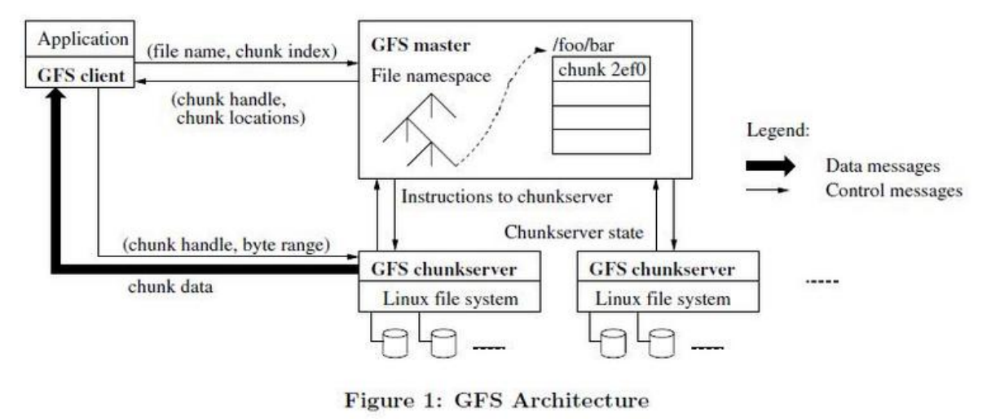
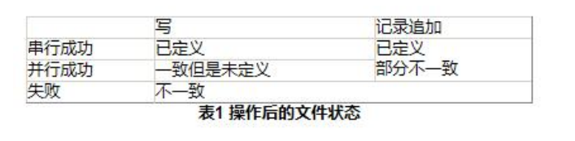
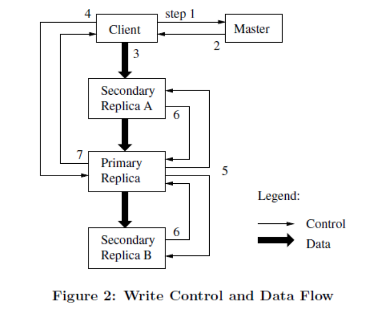
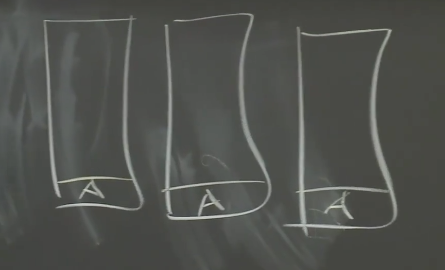
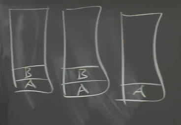
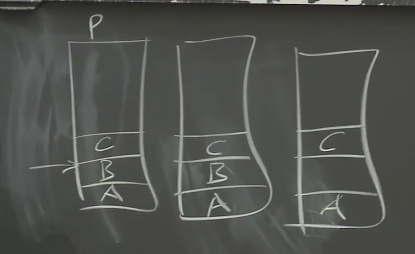
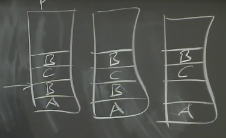

# GFS分布式文件存储系统

## 1. GFS的基本概念

### 1.1 构建一个大型分布式存储系统的需求和挑战
追求高性能 -> 数据分片，分布式存储

分布式故障率高 -> 建立副本提高容错性

副本不一致问题 -> 设计方案提高一致性 -> 引起低性能

我们设计分布式存储系统时需要在这个循环中间取得一些权衡，追求一个目标必然要付出对应代价。

### 1.2 GFS的基本架构

- GFS chunkserver:

    GFS存储的文件都被分割成固定大小的Chunk。在Chunk创建的时候，Master服务器会给每个Chunk分配一个不变的、全球唯一的64位的Chunk标识。Chunk服务器把Chunk以linux文件的形式保存在本地硬盘上，并且根据指定的Chunk标识（chunk handle）和字节范围（byte range）来读写块数据。出于可靠性的考虑，每个块都会复制到多个块服务器上，默认是三个，复制的chunk数被称为复制级别。

- GFS master

    Master节点管理所有的文件系统元数据。这些元数据包括名字空间、访问控制信息、文件和Chunk的映射信息、以及当前Chunk的位置信息等。Master节点周期性地和每个Chunk服务器通讯，发送指令到各个Chunk server并接收Chunk server的状态信息。

- GFS client
  
  GFS客户端代码以库的形式被链接到客户程序里。客户端代码实现了GFS文件系统的API接口函数、应用程序与Master节点和Chunk服务器通讯、以及对数据进行读写操作。客户端和Master节点的通信获取元数据，接下来所有的数据操作都是由客户端直接和Chunk服务器进行交互的。

### 1.3 GFS架构的基本执行流程
1. 首先，客户端自己把文件名和程序指定的字节偏移，根据固定的Chunk大小（默认64mb）转换成文件的Chunk索引；
   
2. 然后，它把文件名和Chunk索引发送给Master节点，Master节点将相应的Chunk标识和副本的位置信息发还给客户端，客户端用文件名和Chunk索引作为key缓存这些信息；
   
3. 之后客户端发送请求到其中的一个副本处（一般会选择最近的）。请求信息包含了Chunk的标识和字节范围。在对这个Chunk的后续读取操作中，客户端不必再和Master节点通讯了，除非缓存的元数据信息过期或者文件被重新打开；
4. 实际上，客户端通常会在一次请求中查询多个Chunk信息，Master节点的回应也可能包含了紧跟着这些被请求的Chunk后面的Chunk的信息，这减少了对master节点的读写，避免master成为系统瓶颈；
5. 另外，客户端会缓存Chunk和服务器的对应关系，这样当再次读取相同Chunk数据时，就不用一次次的去向Master请求相同的信息。
   

### 1.4 master元数据的保存
Master服务器存储3种主要类型的元数据，包括：文件和Chunk的命名空间、文件和Chunk的对应关系、每个Chunk副本的存放地点。所有的元数据都保存在Master服务器的内存中。

前两种类型的元数据（命名空间、文件和Chunk的对应关系）同时也会以记录变更日志的方式记录在操作系统的系统日志文件中，日志文件存储在本地磁盘上，同时日志会被复制到其它的远程Master服务器上。采用保存变更日志的方式，我们能够简单可靠的更新Master服务器的状态，并且不用担心Master服务器崩溃导致数据不一致的风险。

对于第三种类型的元数据（chunk位置信息），Master服务器不会持久保存，而是在Master服务器在启动时，或者有新的Chunk服务器加入时，向各个Chunk服务器轮询它们所存储的Chunk的信息。

- master服务器为何用内存保存元数据
  
  因为元数据保存在内存中，所以Master服务器的操作速度非常快；第二，Master服务器可以在后台简单而高效的周期性扫描自己保存的全部状态信息；最后，高速扫描也方便用于实现Chunk垃圾收集、复制、迁移数据。可以放心的是，master的内存足以存储这些信息，尤其是加入数据压缩算法后。

- 操作日志的保存
  
  操作日志包含了关键的元数据变更历史记录。这对GFS非常重要，因为操作日志是元数据唯一的持久化存储记录，同时也是判断同步操作顺序的逻辑时间基线。

  为了保证日志文件的完整，master会把日志复制到多台远程机器，并且只有先把相应的日志记录写入到本地以及远程机器的硬盘后，才会响应客户端的操作请求。

  Master服务器在灾难恢复时，通过重演操作日志把文件系统恢复到最近的状态。为了缩短Master启动的时间，我们必须使日志足够小，因此Master服务器在日志增长到一定量时对系统状态做一次Checkpoint，将所有的状态数据写入一个Checkpoint文件。在灾难恢复的时候，Master服务器就通过从磁盘上读取这个Checkpoint文件，以及重演Checkpoint之后的有限个日志文件就能够恢复系统。

- chunk位置信息的保存
  
  Master服务器并不保存持久化保存哪个Chunk服务器存有指定Chunk的副本的信息，Master服务器只是在启动的时候轮询Chunk服务器以获取这些信息。master控制了所有的Chunk位置的分配，而且通过周期性的信息监控Chunk服务器的状态，所以它获取的chunk位置信息一定是最新的。
  
  master持久化保存相对于轮询法有许多劣势，而且毕竟只有Chunk服务器才能最终确定一个Chunk是否在它的硬盘上。

### 1.5 GFS一致性保障机制

这里最关键的是要理解，定义未定义针对的是多客户端并发写同一个偏移量的覆盖顺序问题；一致不一致针对的是多个副本相同偏移量的内容是否相同。

如上图，文件块的状态有三种，一致性级别由高到底：已定义（defined），未定义（undefined）但是一致的（consistent），不一致的。理解这几个级别需要一些背景，论文中不同的地方提到了，这里重新组织一下：

- 修改操作。包括写操作和追加操作。写操作需要指定文件块+offset；追加操作只需要数据，成功后系统会将追加成功的偏移量返回给客户端。
  
- 并发写。如果两个客户端同时写同一个文件块的同一偏移量，那么就有先后顺序问题，如果接近同时，系统不保证并发顺序。那么其中客户端再去读，就不一定能读到自己刚写的数据。
- 追加失败。追加操作会保证至少成功一次。追加操作时，假设配置三副本，但是只有两个副本写成功，最后一个副本超时了（可能对应块服务器宕机，当然重启后 GFS 会用 chunk version 来标记其过期 stale 了，从而跳过该 offset。），那么追加操作会重试，并且失败数据不会删除，但是 GFS 有对齐操作，即重试成功后，三个副本中该追加数据的起始偏移量是定义的（也就是一致的），那么其中那个上次失败的副本就会有个空洞，系统会用特殊字符填充。

名词解释：
- region状态：表示文件中某一段范围的状态，这个状态是对于客户端来说的，不同的状态对客户端来说效果不一样。 

- 一致状态：如果所有客户端无论从那个副本读取，读到的数据都一样，则认为文件region状态是一致的。 

- 已定义：客户端写某个偏移量后，再读该偏移量的数据，读到的一定是刚才自己所写。
  
- 未定义的但是一致的：多个客户端并发写同一个偏移量，不确定谁会覆盖谁（这个顺序由 Primary Replica 所在 Chunkserver 来安排，后面将会讲），即写完后再读，不确定是自己写的还是其他人写的。但是保证最终一致性，即并发写完成后，最后几个副本是一致的。
  
- 不一致的：即修改操作后，所有副本同一偏移量的数据并不完全相同。 

- 写入操作：写入操作把数据写在应用程序指定的文件偏移位置上。 

- 追加操作：追加操作写的偏移位置是文件的尾部。

经过了一系列的成功的修改操作之后，GFS通过以下措施确保被修改的文件region是已定义的，并且包含最后一次修改操作写入的数据：
- 对Chunk的所有副本的修改操作顺序一致；
  
- 使用Chunk的版本号来检测副本是否因为它所在的Chunk服务器宕机而错过了修改操作而导致其失效。失效的副本不会再进行任何修改操作，Master服务器也不再返回这个Chunk副本的位置信息给客户端。它们会被垃圾收集系统尽快回收。
- 另外，即使在修改操作成功执行很长时间之后，组件的失效也可能损坏或者删除数据。GFS通过Master服务器和所有Chunk服务器的定期“握手”来找到失效的Chunk服务器，并且使用Checksum来校验数据是否损坏。一旦发现问题，数据要尽快利用有效的副本进行恢复。

## 2. GFS的系统交互

### 2.1 GFS的数据读取
GFS的数据读取流程如下：
1. 首先，客户端自己把文件名和程序指定的字节偏移，根据固定的Chunk大小（默认64mb）转换成文件的Chunk索引；
   
2. 然后，它把文件名和Chunk索引发送给Master节点，Master节点将相应的Chunk标识和副本的位置信息发还给客户端，客户端用文件名和Chunk索引作为key缓存这些信息；
   
3. 之后客户端发送请求到其中的一个副本处（一般会选择最近的）。请求信息包含了Chunk的标识和字节范围。在对这个Chunk的后续读取操作中，客户端不必再和Master节点通讯了，除非缓存的元数据信息过期或者文件被重新打开；
4. 实际上，客户端通常会在一次请求中查询多个Chunk信息，Master节点的回应也可能包含了紧跟着这些被请求的Chunk后面的Chunk的信息，这减少了对master节点的读写，避免master成为系统瓶颈；
5. 另外，客户端会缓存Chunk和服务器的对应关系，这样当再次读取相同Chunk数据时，就不用一次次的去向Master请求相同的信息。

### 2.2 GFS的数据写入（租约（lease）机制）

变更是一个会改变Chunk内容或者元数据的操作，比如写入操作或者记录追加操作，变更操作会在Chunk的所有副本上执行。

我们使用租约（lease）机制来保持多个副本间变更顺序的一致性。Master节点为Chunk的其中一个副本建立一个租约，我们把这个副本叫做主Chunk。主Chunk对Chunk的所有更改操作进行序列化，所有的副本都遵从这个序列进行修改操作。

设计租约机制的目的是为了最小化Master节点的管理负担。租约的初始超时设置为60秒。不过，只要Chunk被修改了，主Chunk就可以申请更长的租期。

租约机制的具体流程如下：

1. 客户机向Master节点询问哪一个Chunk服务器持有当前的租约，以及其它副本的位置。如果没有一个Chunk持有租约，Master节点就选择其中一个副本建立一个租约；
   
2. Master节点将主Chunk的标识符以及其它副本（又称为二级副本）的位置返回给客户机。客户机缓存这些数据以便后续的操作。注意，只有在主Chunk不可用，或者主Chunk回复信息表明它已不再持有租约的时候，客户机才需要重新跟Master节点联系；
3. 客户机以任意顺序把要写入的数据推送到所有的副本上。Chunk服务器接收到数据并保存在它的内部LRU缓存中，一直到数据被执行写入磁盘请求或者过期交换出去；
4. 当所有的副本在传输网络中都确认接收到了数据，客户机发送写请求到主Chunk服务器。主Chunk为接收到的所有操作分配连续的序列号，序列号保证了操作顺序执行。它顺序执行这些操作，并更新自己的状态；
5. 主Chunk把写请求传递到所有的副本。每个副本依照主Chunk分配的序列号以相同的顺序执行这些操作；
6. 所有的二级副本回复主Chunk，它们已经完成了操作；
7. 主Chunk服务器回复客户机。如果任何副本产生了任何错误，都会返回给客户机，此时客户端的请求被确认为失败，被修改的region处于不一致的状态。客户机会先从步骤（3）到步骤（7）做几次尝试，如果依然失败就全部从头开始。

注意：
- 如果应用程序一次写入的数据量很大，或者数据跨越了多个Chunk，GFS客户机代码会把它们分成多个写操作；
- 在执行写入操作时，可能会被其它客户机上同时进行的操作打断或者覆盖，因此共享的文件region的尾部可能包含来自不同客户机的数据片段。尽管如此，由于这些分解后的写入操作在所有的副本上都以相同的顺序执行完成，Chunk的所有副本都是一致的。这使文件region处于表1描述的“一致但是未定义”的状态。

### 2.3 数据流的传递
为了提高网络效率，GFS采取了把数据流和控制流分开的措施。在控制流从客户机到主Chunk、然后再到所有二级副本的同时，数据以管道的方式，顺序的沿着Chunk服务器链推送，而不是以其它拓扑形式分散推送（例如树型拓扑结构，树形传输可能会造成根节点负载过重，不能均摊负载和网络带宽）。

为了尽可能的避免出现网络瓶颈和高延迟的链接，每台机器都尽量的在网络拓扑中选择一台还没有接收到数据的、离自己最近的机器作为目标推送数据（节点距离可以通过IP地址计算处理）。

### 2.4 原子的记录追加

- 处理并发记录追加操作：
  
    GFS 提供一种原子性的追加操作，叫做记录追加（Record Append）。不同于普通的写入操作，需要指定偏移量和数据，记录追加操作只需要指定数据，在写成功后，写成功的记录偏移量将会返回给客户端。

    但是这里存在一个问题，如果多个客户端并发写同一个区域，大概率会造成数据的交叠：即重叠区域的数据部分来自客户端A，另外部分来自客户端B，从而造成不一致的现象。但是对于记录追加操作，系统会通过以下手段来保证写入的数据的原子性（即单个记录内容只来自一个客户端）和可靠性：

    - 如果遇到多客户端并发，由系统统一安排追加顺序，并且单个记录追加时不会被中断。
    - 如果由于节点或者网络故障导致追加失败，会对记录进行重试，即保证至少写成功一次。

    开启O_APPEND后，GFS系统保证移动到文件末尾并且进行数据追加是一个原子调用。GFS 的分布在多台机器上的多个客户端并发写一个文件的应用很依赖此操作。

- 原子的记录追加具体实现方式：

    具体到实现上，只需要在上面图2提到的数据流中稍作改动即可。在数据被推送到各个备份节点之后，客户端会向主备份节点发送落盘请求。主备份节点首先会检查写入数据之后，当前块是否会超过规定块尺寸（64M）。如果超过，则并不落盘，而将当前块剩余空间打满padding（比如说填入特殊字符）；然后提醒客户端在下一个块进行重试。因此追加写对记录的最大size是有要求的，不能超过块大小的四分之一，这样每次追加写的时候每个块浪费最多不超过四分之一。

    如果记录在任何一个备份节点上写入失败，客户端都会对该追加操作进行重试。由此可能会造成某个备份中存在一些失败的写入部分，从而有超过一份的该记录数据。如前面一致性一些所说，GFS 不严格保证所有备份间数据逐字节一致，它仅保证记录作为一个整体被原子的成功的写入一次，并且各个备份的这份成功数据的所有偏移量保持一致。由此，才能仅返回一个偏移量给客户端，并且下一个操作可以从同一个偏移量进行下一次写。

- 处理写入失败部分：
  
    对于追加写，GFS 提供至少成功一次的语义保证。由于记录写失败了会重试，但是并不会删除，那么就必然存在一些失败记录。根据前面所定义的一致性模型，对于记录追加操作来说，成功写入的请求是已定义的，因此也是一致的。而不成功写入的请求，是不一致的，即未定义的。那应该如何处理这些失败部分呢？

    失败部分包含错误记录和写重叠的记录。GFS 的策略是：对于错误记录，在 Reader 端对这些错误记录进行处理，读入 block 以及对应校验和在内存中作比对，如果不一致就跳过；对于写重的记录，writer 提供了 record id，reader 可以在读取的时候根据其进行过滤。

### 2.5 原子追加示例
当我们追加数据时，面对Chunk的三个副本，当客户端发送了一个追加数据的请求，要将数据A追加到文件末尾，所有的三个副本，包括一个Primary和两个Secondary，都成功的将数据追加到了Chunk，所以Chunk中的第一个记录是A。

假设第二个客户端加入进来，想要追加数据B，但是由于网络问题发送给某个副本的消息丢失了。所以，追加数据B的消息只被两个副本收到，一个是Primary，一个是Secondary。这两个副本都在文件中追加了数据B，所以，现在我们有两个副本有数据B，另一个没有。

之后，第三个客户端想要追加数据C，并且第三个客户端记得下图中左边第一个副本是Primary。Primary选择了偏移量，并将偏移量告诉Secondary，将数据C写在Chunk的这个位置。三个副本都将数据C写在这个位置。

对于数据B来说，客户端会收到写入失败的回复，客户端会重发写入数据B的请求。所以，第二个客户端会再次请求追加数据B，或许这次数据没有在网络中丢包，并且所有的三个副本都成功追加了数据B。现在三个副本都在线，并且都有最新的版本号。

之后，如果一个客户端读文件，读到的内容取决于读取的是Chunk的哪个副本。客户端总共可以看到三条数据，但是取决于不同的副本，读取数据的顺序是不一样的。如果读取的是第一个副本，那么客户端可以读到A、B、C，然后是一个重复的B。如果读取的是第三个副本，那么客户端可以读到A，一个空白数据，然后是C、B。所以，如果读取前两个副本，B和C的顺序是先B后C，如果读的是第三个副本，B和C的顺序是先C后B。所以，不同的读请求可能得到不同的结果，这就是我们所说的一致但未定义。

### 2.6 快照
我们的用户可以使用快照迅速的创建一个巨大的数据集的分支拷贝，这样之后就可以轻松的提交或者回滚到备份时的状态。

我们用标准的copy-on-write技术实现快照。当Master节点收到一个快照请求，它首先取消作快照的文件的所有Chunk的租约。这个措施保证了后续对这些Chunk的写操作都必须与Master交互交互以找到租约持有者。这就给Master节点一个率先创建Chunk的新拷贝的机会。

租约取消或者过期之后，Master节点把这个操作以日志的方式记录到硬盘上。然后，Master节点通过复制源文件或者目录的元数据的方式，把这条日志记录的变化反映到保存在内存的状态中。新创建的快照文件和源文件指向完全相同的Chunk地址。

事实上并没有真正复制一个全新的文件系统作为快照，而是依然使用原来的文件系统，并在接下来的使用中用COW创建新的文件系统，并投入正常运行：

- 在快照操作之后，当客户机第一次想写入数据到Chunk C，它首先会发送一个请求到Master节点查询当前的租约持有者；

- Master节点注意到Chunke C的引用计数超过了1。Master节点不会马上回复客户机的请求，而是选择一个新的Chunk句柄C'；

- 之后，Master节点要求每个拥有Chunk C当前副本的Chunk服务器创建一个叫做C'的新Chunk（COW的方式）；

- Master节点确保新Chunk C'的一个副本拥有租约，之后回复客户机，客户机得到回复后就可以正常的写这个Chunk C'，而不必理会它是从一个已存在的Chunk C用COW拷贝出来的。

## 3. Master节点的操作
### 3.1 名称空间管理和锁
master采用树形结构存储文件名称（也就是文件的绝对路径）。在逻辑上，GFS的名称空间就是一个全路径和元数据映射关系的查找表，利用前缀压缩，这个表可以高效的存储在内存中。在存储名称空间的树型结构上，每个节点（绝对路径的文件名或绝对路径的目录名）都有一个关联的读写锁。

每个Master节点的操作在开始之前都要获得一系列的锁。通常情况下，如果一个操作涉及/d1/d2/…/dn/leaf，那么操作首先要获得目录/d1，/d1/d2，…，/d1/d2/…/dn的读锁，以及/d1/d2/…/dn/leaf的读
写锁。另外注意，根据操作的不同，leaf可以是一个文件，也可以是一个目录。

因为名称空间可能有很多节点，读写锁采用惰性分配策略，在不再使用的时候立刻被删除。同样，锁的获取也要依据一个全局一致的顺序来避免死锁：首先按名称空间的层次排序，在同一个层次内按字典顺序排
序。

### 3.2 master副本的位置
GFS集群是高度分布的多层布局结构，而不是平面结构。典型的拓扑结构是有数百个Chunk服务器安装在许多机架上，Chunk服务器被来自同一或者不同机架上的数百个客户机轮流访问，不同机架上的两台机器间的通讯可能跨越一个或多个网络交换机。

Chunk副本位置选择的策略服务两大目标：最大化数据可靠性和可用性，最大化网络带宽利用率。所以我们必须在多个机架间分布储存Chunk的副本，这保证Chunk的一些副本在整个机架被破坏或掉线的情况下依然存在且保持可用状态；这还意味着在网络流量方面，尤其是针对Chunk的读操作，能够有效利用多个机架的整合带宽。

### 3.3 chunk副本的用途
chunk副本有三种用途：Chunk创建，重新复制和重新负载均衡。

- chunk创建的位置：
  
  当Master节点创建一个Chunk时，它会选择在哪里放置初始的空的副本。Master节点会考虑以下几个因素：
  - 平衡硬盘使用率。我们希望在低于平均硬盘使用率的Chunk服务器上存储新的副本；
  
  - 限制同一台Chunk服务器上的正在进行的克隆操作的数量。因为创建操作也意味着随之会有大量的写入数据的操作；
  - 尽量把Chunk的副本分布在多个机架之间。
  
- chunk重新复制：
  
  当Chunk的有效副本数量由于各种原因，少于用户指定的复制因数的时候，Master节点会重新复制它。每个需要被重新复制的Chunk都会根据几个因素进行排序：
  - 一个因素是Chunk现有副本数量和复制因数相差多少。例如，丢失两个副本的Chunk比丢失一个副本的Chunk有更高的优先级；
  
  - 另外，我们优先重新复制活跃文件的Chunk，而不是最近刚被删除的文件的Chunk；
  - 最后，为了最小化失效的Chunk对正在运行的应用程序的影响，如果这个chunk会阻塞客户机程序处理流程，我们提高会它的优先级。
  
  确定排序后，按照前面的方法选择chunk副本的存储位置。

- chunk周期性负载均衡：
  
  最后，Master服务器周期性地对副本进行重新负载均衡：它检查当前的副本分布情况，然后移动副本以便更好的利用硬盘空间、更有效的进行负载均衡。
  
  通常Master节点移走那些剩余空间低于平均值的Chunk服务器上的副本，根据前面的副本位置选择策略移动到新的chunk服务器上，从而平衡系统整体的硬盘使用率。

### 3.4 垃圾回收
垃圾回收的流程：

1. master将文件变成隐藏文件。当一个文件被应用程序删除时，Master节点象对待其它修改操作一样，立刻把删除操作以日志的方式记录下来。但是，Master节点并不马上回收资源，而是把文件名改为一个包含删除时间戳的、隐藏的名字；

2. master删除隐藏文件。当Master节点对文件系统命名空间做常规扫描的时候，它会删除所有三天前的隐藏文件（这个时间间隔是可以设置的）；

3. master删除文件元数据。当隐藏文件被从名称空间中删除，Master服务器内存中保存的这个文件的相关元数据才会被删除，这也有效的切断了文件和它包含的所有Chunk的连接；

4. master删除chunk元数据。在对Chunk名字空间做类似的常规扫描时，Master节点找到孤儿Chunk（不被任何文件包含的Chunk）并删除它们的元数据；

5. chunk服务器删除chunk副本。Chunk服务器在和Master节点交互中，报告它拥有的Chunk子集的信息，Master节点回复Chunk服务器哪些Chunk在Master节点保存的元数据中已经不存在了，Chunk服务器可以任意删除这些Chunk的副本。

### 3.5 过期失效的副本检测
当Chunk服务器失效时，Chunk的副本有可能因错失了一些修改操作而过期失效。Master节点保存了每个Chunk的版本号，用来区分当前的副本和过期副本。

无论何时，只要Master节点和Chunk签订一个新的租约，它就增加Chunk的版本号，然后通知最新的副本，Master节点和这些副本都把新的版本号记录在它们持久化存储的状态信息中。

如果某个副本所在的Chunk服务器正好处于失效状态，那么副本的版本号就不会被增加。Master节点在这个Chunk服务器重新启动，并且向Master节点报告它拥有的Chunk的集合以及相应的版本号的时候，就会检测出它包含过期的Chunk。

Master节点在例行的垃圾回收过程中移除所有的过期失效副本。另外，Master节点在通知客户机哪个Chunk服务器持有租约、或者指示Chunk服务器从哪个Chunk服务器进行克隆时，消息中都附带了Chunk的版本号。客户机或者Chunk服务器在执行操作时都会验证版本号以确保总是访问当前版本的数据。

## 4. 容错和诊断
### 4.1 高可用性
GFS使用两条简单但是有效的策略保证整个系统的高可用性：快速恢复和复制。

1. 快速恢复
   
   不管Master服务器和Chunk服务器是如何关闭的，它们都被设计为可以在数秒钟内恢复它们的状态并重新启动。如果重启期间有其它服务器连接并连接失败，会在重启后重试连接。

2. chunk复制
   
   正如之前讨论的，每个Chunk都被复制到不同机架上的不同的Chunk服务器上。当有Chunk服务器离线了，或者通过Chksum校验发现了已经损坏的数据，Master节点通过克隆已有的副本保证每个Chunk都被完整复制。

3. master服务器的复制
   
   为了保证Master服务器的可靠性，Master服务器的状态也要复制。Master服务器所有的操作日志和checkpoint文件都被复制到多台机器上。
   
   简单说来，当一个master服务器失效时，几乎可以立刻重新启动；
   
   如果Master进程所在的机器无法重新启动时，处于GFS系统外部的监控进程会在其它的存有完整操作日志的机器上启动一个新的Master进程。客户端使用规范的名字访问Master（比如gfs-test）节点，这个名字类似DNS别名，因此也就可以在Master进程转到别的机器上执行时，通过更改别名的实际指向访问新的Master节点。

   此外，GFS中还有些“影子”Master服务器，这些“影子”服务器在“主”Master服务器宕机的时候提供文件系统的只读访问。“影子”Master服务器为了保持自身状态是最新的，它会读取一份当前正在进行的操作的日志副本，并且依照和主Master服务器完全相同的顺序来更改内部的数据结构。和主Master服务器一样，“影子”Master服务器在启动的时候也会从Chunk服务器轮询数据。

### 4.2 数据完整性：checksum
磁盘损坏导致数据在读写过程中损坏或者丢失是非常常见的，因此，每个Chunk服务器必须独立维护Checksum来校验自己的副本的完整性。

chunk大小默认64MB，我们把每个Chunk进一步细分，分成64KB大小的块。每个块都对应一个32位的Checksum。

对于读操作来说，在把数据返回给客户端或者其它的Chunk服务器之前，Chunk服务器会校验读取操作涉及的范围内的块的Checksum。如果发生某个块的Checksum不正确，Chunk服务器返回给请求者一个错误信息，并且通知Master服务器这个错误。Master服务器会从其它副本克隆数据进行恢复，并删除chunk服务器中错误的副本。

对于写操作，如果写操作覆盖已经存在的一个范围内的Chunk，我们必须读取和校验被覆盖的第一个和最后一个块，然后再执行写操作，操作完成之后再重新计算和写入新的Checksum。如果我们不校验第一个和最后一个被写的块，那么新的Checksum可能会隐藏没有被覆盖区域内的数据错误。

另外，在Chunk服务器空闲的时候，它会扫描和校验每个不活动的Chunk的内容。这使得我们能够发现很少被读取的Chunk是否完整。一旦发现有Chunk的数据损坏，Master可以创建一个新的、正确的副本，然后把损坏的副本删除掉。

### 4.3 诊断工具
RPC日志包含了网络上发生的所有请求和响应的详细记录，但是不包括读写的文件数据。通过匹配请求与回应，以及收集不同机器上的RPC日志记录，我们可以重演所有的消息交互来诊断问题。日志还用来跟踪
负载测试和性能分析。

日志对性能的影响很小（远小于它带来的好处），因为这些日志的写入方式是顺序的、异步的。最近发生的事件日志保存在内存中，可用于持续不断的在线监控。