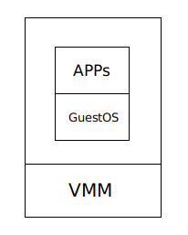
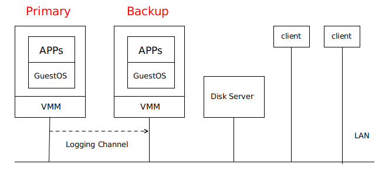
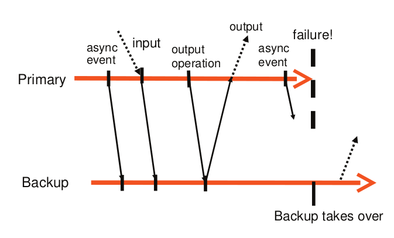
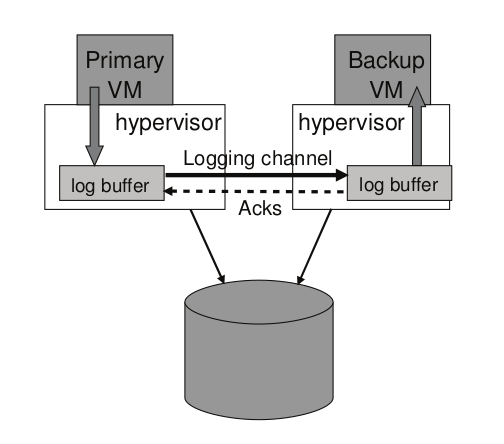

# VMware FT
主要内容来自博客：https://www.cnblogs.com/brianleelxt/p/13245754.html
## 1. 前言
本论文主要介绍了一个用于提供容错虚拟机 (fault-tolerant virtual machine) 的企业级商业系统，该系统包含了两台位于不同物理机的虚拟机，其中一台为 primary ，另一台为 backup ，backup 备份了 primary 的所有执行 。当 primary 出现故障时，backup 可以上线接管 primary 的工作，以此来提供容错 。

## 2. 主/备份方法
实现容错服务器的一种常见方法是 主/备份方法 。backup 状态与 primary 保持相同，primary 故障时，使用 backup 进行接管。并且以这种方式将故障对于 client 隐藏，不会丢失任何数据 。 

主/备份方法中保持状态同步的方法有以下两种：

State transfer（状态转移）：primary 持续地将所有状态（ 包括 CPU、内存和 I/O 设备 ）变化发送给 backup 。这种方法所需带宽非常大 。

Replicated state machine（复制状态机）：将服务器抽象为确定性状态机 。让 primary 和 backup 按照相同的顺序执接收相同的输入请求，对于不确定的操作使用额外的协调来保证主备状态一致。这种方法实现复杂，但是所需带宽较小 。本文便是采用这种方法 。

确定性状态机：多台状态机从相同的初始状态开始、按照相同的顺序执行相同的操作，则它们的最终状态是一致的 。

状态机方法允许 primary 和 backup 进行更大的物理分离 。

## 3. 虚拟机的选择
虚拟机 ( virtual machine ) 不是通过硬件来启动操作系统，而是在硬件之上会调用一个 VMM ，VMM 的工作实际上就是在硬件上模拟多个虚拟计算机 。VMM 上执行着 GuestOS ，再上面是应用程序 。

VMM 即 virtual machine monitor ( VMM )，GuestOS 即运行在虚拟机中的操作系统，与之对应的是 HostOS ，指物理机里的操作系统 。

在物理机上确保确定性执行是困难的，因为其会接收到很多不确定输入（ 如定时器中断 ），因此可以采用虚拟机，VMM 对硬件进行模拟和控制，可以捕获到这些不确定输入的所有相关信息，使得 backup 可以重放这些不确定输入。

因为我们讨论的故障主要是指服务器故障，因此不同的虚拟机要位于不同的物理机上，否则便失去了容错的意义。

## 4. 基本设计
### 4.1 基本架构

同步状态方法有两种层级：
- 应用层（Application state）。如 GFS，更为高效，只需要发送高维操作即可，缺点是需要在应用层进行容错。

- 机器层（Machine level）。可以让运行在服务器上的应用无需改动而获取容错能力。但需要细粒度的同步机器事件（中断、DMA）；并且需要修改机器底层实现以发送这些事件，VM FT选择了这种方法。

VM FT的架构如下图：

Primary VM 和 Backup VM 运行在同一网络环境中的不同物理机上，两者可以访问同一个 Disk Server ，即论文当中的 Shared Disk 。

只有 Primary VM 向外界通知自己的存在，因此所有网络输入或其他输入（磁盘、鼠标、键盘）都进入 Primary VM 。

**Primary VM 接收的所有输入都通一个称为 Logging Channel 的网络连接发送到 Backup VM ，以保证两者状态相同。Logging Chnnel内部传输两种内容：执行确定指令时客户端发给primary的网络数据包，以及primary执行不确定指令时的log entry。** Backup VM 的指令执行结果与 Primary VM 的结果相同，但只有 Primary VM 返回给 client 结果，Backup VM 的结果会被它的 VMM 丢弃 。

系统使用 Primary VM 和 Backup VM 之间的心跳包和 Logging Channel 上的流量监控来检测 Primary VM 或 Backup VM 是否是失效 。此外，必须确保 Primary VM 和 Backup VM 中只有一个接管执行 。

事实证明，这些主备虚拟机并不适用于本地磁盘，而是会和某些磁盘服务器进行通信。（ 论文中并未提到这点 ）

### 4.2 确定性重放
由上文可知，VM-FT 建模为确定性状态机的复制 。对于一系列输入，对 primary 的执行进行记录并确保 backup 以相同方式执行的基本技术称为 确定性重放 。

primary 的操作中包含了 确定性操作 和 不确定性操作 。确定性操作在 primary 和 backup 上的执行结果是相同的，不确定性操作包括：
- 客户端输入。假设有一个来自于客户端的输入，这个输入随时可能会送达，所以它是不可预期的。当我们说客户端输入的时候，我们实际上是指接收到了一个网络数据包。而一个网络数据包对于我们来说有两部分，一个是数据包中的数据，另一个是提示数据包送达了的中断。当网络数据包送达时，通常网卡的DMA会将网络数据包的内容拷贝到内存，之后触发一个中断。操作系统会在处理指令的过程中消费这个中断。对于Primary和Backup来说，这里的步骤必须看起来是一样的，否则它们在执行指令的时候就会出现不一致。对于Primary和Backup，最好要在相同的时间，相同的位置触发，否则执行过程就是不一样的，进而会导致它们的状态产生偏差。所以，我们不仅关心网络数据包的内容，还关心中断的时间。

- 有一些指令在不同的计算机上的行为是不一样的，这一类指令称为怪异指令，如随机数生成指令、在不同时间获得时间的指令、生成设备唯一 ID 的指令等；

- 多核并发，服务中的指令会在不同的核上何以某种方式交错执行，执行顺序不可预测（ 本论文中的方法只针对单核处理器，不解决此问题 ）

**对于确定性操作，保持两台虚拟机输入相同即可。接下来是解决不确定性操作的方法。** 这里不讨论第三种不确定性操作，前两种不确定性操作会在 Logging Channel 中传送。

确定性重放记录 primary 的输入和 primary 执行相关的所有可能的不确定性，记录在 log entry 流中，发送给 backup 并使其重放 ：

- 对于不确定的操作，将记录足够的信息，确保其在 backup 上重新执行能够得到相同的状态和输出；
  
- 对于不确定的事件，如定时器或 IO 完成中断，事件发生的确切指令会被记录下来，重放时，backup 会在指令流中相同的位置重放这些事件。

log entry 中应该包含了：

- 事件发生时的指令序号；
- 类型：指明是网络输入还是其他指令；
- 数据：数据包里的数据，若是不确定指令，则此数据是该指令在 primary 的执行结果，所以 backup 就可以对该指令提供与 primary 相同的执行结果。

不确定性指令执行过程（ 即使 primary 和 backup 在同一状态，执行不确定性指令后也会产生不同结果 ）：

- primary：

  - VMM 在 primary 执行指令时设置中断

  - VMM 执行指令并记录结果

  - 发送结果和指令序号到 backup
  
- backup：

    - VMM 读 log entry ，在该指令序号处设置中断

    - VMM 应用从 primary 执行得到的结果，自己产生的结果被丢弃，从而保证主备一致

### 4.3 输出要求和规则
- 输出要求：
  
  若 primary 发生故障后且 backup 接管后，backup 必须以一种与原 primary 已发送到外部的输出完全一致的方式运行 。

    只要满足了输出要求，故障转移就不会丢失外部可见的状态或数据，client 也不会注意到 server 服务中断或有不一致 。

    可能有一种特殊情况会发生：如果 primary 在执行输出操作后立即故障，backup 在完成接管之前，可能还未执行到同样的输出操作，就被其他不确定事件所影响（ 如计时中断 ），这样 backup 就无法以与 primary 发生故障时的相同状态上线，为此提出了 输出规则 。

- 输出规则：
  
  primary 必须延后将输出发送到外部世界的动作，直到 backup 已经接收并确认 与产生该输出的操作相关 的 log entry 。

    基于输出规则，primary 和 backup 的交互如下图所示：
    
    primary 等待来自 backup 的 ACK 时，不会停止执行，只需要延迟输出的发送 （ 异步执行 ）。

    一些故障发生情况：

    - 如果 primary 在收到 ACK 之前故障，它不会返回结果给 client ，由于 backup 的输出会被丢弃，所以两者在 client 看来是一致的，即未收到 server 回复 。

    - 如果 primary 在发送输出后故障，backup 在接管后也执行发送，client 会收到两次输出 。但是这种情况不会造成不良后果，因为对于 TCP 连接来说，它会处理重复的数据包；对于磁盘来说，会对同一块存储区覆盖写入。
    
  **这种输出规则提高了系统鲁棒性，但是由于primary输出给client之前必须接收backup的ACK，因此执行任务延时会更长。**

### 4.4 检测和响应故障
两种 VM 都有可能发生故障：

- 如果是 backup 故障，primary 将停止在 logging channel 上发送 log entry ，并继续执行；
- 如果是 primary 故障，backup 会继续重放 log entries ，重放结束后 上线 成为 primary ，此时，它可以向外界生成输出 。

VM-FT 检测故障的方式有 UDP 心跳检测和监控 logging channel 中的流量以及 backup 发送给 primary 的 ACK 。若心跳或日志流量停止的时间超过了特定超时时间（ 大约几秒 ），就会声明故障。

这样的故障检测方法，在有网络故障时，容易遇到 split-brain 问题：即 primary 和 backup 之间通信断开，但此时 primary 还在运行，若 backup 此时上线，会造成两者同时执行的问题，可能会导致数据损坏 。

为解决 split-brain 问题，使 Disk Server 支持 atomic test-and-set 测试，即在 Disk Server 上维护一个 flag ，第一个访问此 flag 的 VM 会成为 primary ，第二个访问此 flag 的 VM 不会上线 。（ 类似于锁 ）

test-and-set类似于仲裁官，Primary和Backup在上线前都需要获取第三方（Disk Server）的Test-and-Set标志位，它们或许会同时发送一个Test-and-Set请求，给Test-and-Set服务。当第一个请求送达时，Test-and-Set服务会说，这个标志位之前是0，现在是1。第二个请求送达时，Test-and-Set服务会说，标志位已经是1了，你不允许成为Primary。**在所有情况下，两个虚拟机中任意一个觉得对方挂了，想要上线的那个虚拟机就需要获得Test-and-Set服务的锁。**

### 4.5 恢复冗余
primary 发生故障，backup 上线时，在新的物理机上建立 backup ，恢复冗余，继续进入到容错状态。

VM vSephere 实现了一个集群服务，用于维护管理和资源信息。当发生故障时，集群服务根据资源使用情况和其他约束来确定新的 backup 的最佳服务器，并将其复制成为 backup 。

### 4.6 管理日志通道
VMM 为 primary 和 backup 分别维护了一个 log buffer ，如下图所示：

- primary 执行时，会将 log entry 生成到 log buffer 当中
  
- primary 的 log buffer 会尽快将内容清除到 logging channel
- log entry 一到达 logging channel 就会被读到 backup 的 log buffer
- backup 发送 ACK 给 primary
- 若 primary 的 log buffer 已满，primary 会等待；若 backup 的 log buffer 已空，backup 会等待 。

另外，为了防止 backup 的重放落后太多，在发送和确认 log entry 的协议中，会发送附加信息来确定 primary 和 backup 之间的 实时执行延迟 ，通常小于 100ms 。若 backup 出现明显的延迟，VM-FT 会通知调度器给它分配更少的 CPU 资源，从而降低 primary 的速度；若 backup 追起来了，逐渐增加 primary 的速度。

### 4.7 磁盘的内存访问竞争
磁盘操作可能和 VM 中的应用程序或 OS 存在内存访问竞争 。

这种竞争在网络数据包或磁盘块到达 primary 时产生 。在没有 VM-FT 的情况下，相关硬件会通过 DMA 将该数据复制到内存中 。若 APP/OS 也在同时读取这块内存。那么对于 primary 和 backup ，由于时间上的微小差异，可能一个在 DMA 之前读取，一个在 DMA 之后读取，就导致了不一致 。

解决方法是使用 bounce buffer ，它的大小与磁盘操作访问的内存大小相同 。primary 的 VMM 首先复制网络数据或磁盘块到 bounce buffer ，此时 primary 无法访问它 ，Hyperbisor 中断 primary 使其暂停执行，并记录中断的指令 。然后 VMM 将 bounce buffer 中的内容复制到 primary 的内存 ，并让其继续执行 。通过 logging channel 将数据送到 backup 之后，backup 的 VMM 在相同指令处中断 backup ，将数据复制到 backup 的内存后，最后恢复 backup 的执行 。

## 5. 机器级复制和应用级复制
### 5.1 机器级复制
机器级复制 即复制了内存中和寄存器中的所有内容 。优点为可以在 VM-FT 上运行任何软件；缺点为不够高效

### 5.2 应用级复制
应用级复制 即 primary 仅发送 high-level 操作给 backup 。如数据库，同步的状态仅为数据库内容，不是所有的内存内容，操作仅为数据库命令（ get 、put 之类 ），没有网络包或中断 。GFS 使用的也是应用级复制 。

优点：更少的细粒度同步、更低的开销

缺点：应用程序必须理解系统的容灾

## 6. VM-FT 和 GFS 容错的比较
VM-FT 备份的是计算，可以用它为任何已有的网络服务器提供容错性。VM-FT 提供了相当严谨的一致性而且对 client 和 server 都是透明的。例如，你可以利用 VM-FT 为已有的邮件服务器提供容错性。

相比之下，GFS为存储提供容错性。因为 GFS 只针对一种简单的服务提供容错性，它的备份策略会比 VM-FT 更为高效：例如，GFS 不需要使中断发生在所有的副本的同一指令上。GFS 通常只会被用作一个对外提供完整容错服务的系统的一部分：例如，VM-FT 本身也依赖了一个在主备虚拟机间共享的有容错性的存储服务，而你则可以用类似于 GFS 的东西来实现这个模块（ 虽然从细节上来讲 GFS 不太适用于 FT ）。