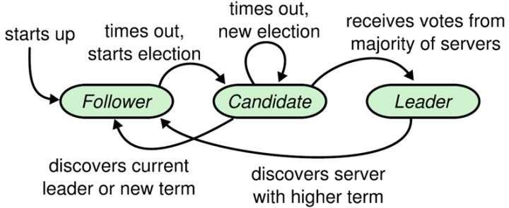
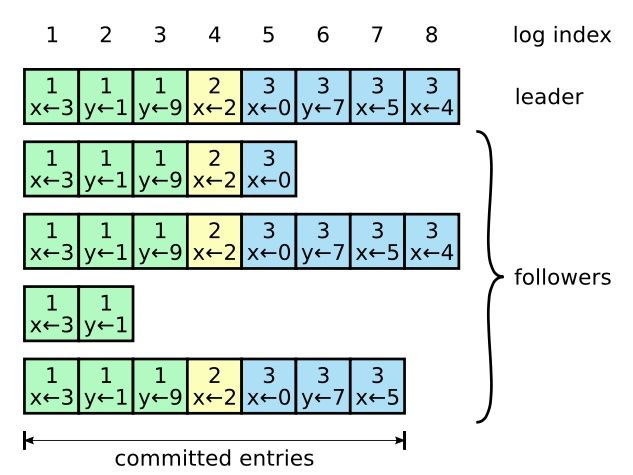

# Raft
## 1. Split Brain问题
假设我们有一个网络，这个网络里面有两个服务器（S1，S2），这两个服务器都是我们Test-and-Set服务的拷贝。这个网络里面还有两个客户端（C1，C2），它们需要通过Test-and-Set服务确定主节点是谁。在这个例子中，这两个客户端本身就是VMware FT中的Primary和Backup虚拟机，它们需要S服务器来裁判谁来上线，S1和S2必须保持状态一致。

如果网络线路出现了故障，从而导致C1可以与S1交互，但是不能与S2交互。同时，C2可以与S2交互，但是不能与S1交互。这种故障将网络分为两个部分，这两个VMware 虚机都会认为自己成为了主虚拟机而不需要与另一个虚拟机协商，这种故障被称为脑裂（split brain），因为S系统无法保证。

这个问题我们采用过半票决（Majority Vote）的方法来解决。这是Raft论文中出现的，用来构建Raft的一个基本概念。过半票决系统的第一步在于，服务器的数量要是奇数，而不是偶数。

例如在上图中（只有两个服务器），中间出现故障，那两边就太过对称了。这里被网络故障分隔的两边，它们看起来完全是一样的，它们运行了同样的软件，所以它们也会做相同的事情，这样不太好（会导致脑裂）。

但是，如果服务器的数量是奇数的，那么当出现一个网络分割时，两个网络分区将不再对称。**在任何时候为了完成任何操作，你必须凑够过半的服务器来批准相应的操作，从而保证C1和C2之间只有一个获得上线许可，这里的过半是指超过服务器总数的一半**。直观来看，如果有3个服务器，那么需要2个服务器批准才能完成任何的操作。

另外，在保证过半票决系统的可靠性方面，如果系统有 2 * F + 1 个服务器，那么系统最多可以在F个服务器出现故障的情况下，仍然正常工作。

## 2. Raft初探
### 2.1 Raft的应用
从软件的角度来看一个Raft节点，我们可以认为在该节点的上层是应用程序代码。对于一个Key-Value数据库而言，对应的状态就是Key-Value Table，应用程序往下，就是Raft层。所以，Key-Value数据库需要对Raft层进行函数调用，来传递自己的状态和Raft反馈的信息。如下图所示：

### 2.2 Raft的执行过程
整个系统的执行过程如下：

1. 假设客户端将请求发送给Raft的Leader节点，在服务端程序的内部，应用程序首先并不执行，而是会将来自客户端的请求对应的操作向下发送到Raft层，并且告知Raft层，请把这个操作提交到多副本的日志（Log）中，并在完成时通知我；
   
2. 之后，Raft节点之间相互交互，直到过半的Raft节点将这个新的操作加入到它们的日志中，也就是说这个操作被过半的Raft节点复制了；

3. 当且仅当Raft的Leader节点知道了过半节点的副本都有了这个操作的拷贝之后。Leader节点中的Raft层，会向上发送一个通知到应用程序（即提交操作），现在应用程序可以开始执行这个操作了；

4. 当一个操作最终在Leader节点被提交之后，会发送信息，让每个副本节点的Raft层将相同的操作提交到本地的应用程序层（实际上committed消息不会单独发出，而是被夹带在下一个AppendEntries消息中）。在本地的应用程序层，会将这个操作更新到自己的状态。

### 2.3 Raft的模块
不同于Paxos算法直接从分布式一致性问题出发推导出来，Raft算法则是从多副本状态机的角度提出，用于管理多副本状态机的日志复制。Raft实现了和Paxos相同的功能，它将一致性分解为多个子问题：**Leader选举（Leader election）、日志同步（Log replication）、安全性（Safety）、日志压缩（Log compaction）、成员变更（Membership change）等**。同时，Raft算法使用了更强的假设来减少了需要考虑的状态，使之变的易于理解和实现。

Raft将系统中的角色分为领导者（Leader）、跟从者（Follower）和候选人（Candidate）：

- Leader：接受客户端请求，并向Follower同步请求日志，当日志同步到大多数节点上后告诉Follower提交日志。

- Follower：接受并持久化Leader同步的日志，在Leader告之日志可以提交之后，提交日志。
- Candidate：Leader选举过程中的临时角色。

Raft要求系统在任意时刻最多只有一个Leader，正常工作期间只有Leader和Followers。Raft算法角色状态转换如下：

Follower只响应其他服务器的请求。如果Follower超时没有收到Leader的消息，它会成为一个Candidate并且开始一次Leader选举。收到大多数服务器投票的Candidate会成为新的Leader。Leader在宕机之前会一直保持Leader的状态。

Raft算法将时间分为一个个的任期（term），如果followers认为leader失联，就会开启新的term的leader选举。在成功选举Leader之后，Leader会在整个term内管理整个集群。如果Leader选举失败，该term就会因为没有Leader而结束。

**Raft解决的两个最大的问题，也是Raft的核心思路有两个点：Leader选举和日志同步。**

## 3. 关于Raft的Log
Raft系统之所以对Log关注这么多有三个原因：
1. Log是Leader用来对操作排序的一种手段，这对于复制状态机而言至关重要；

2. Log的另一个用途是，在一个Follower副本收到了操作，但是还没有执行操作时。该副本需要将这个操作存放在某处，直到收到了Leader发送的新的commit号才执行；

3. Log的另一个用途是用在Leader节点，Leader需要在它的Log中记录操作，因为这些操作可能需要重传给Follower。如果一些Follower由于网络原因或者其他原因短时间离线了或者丢了一些消息，Leader需要能够向Follower重传丢失的Log消息。所以，Leader也需要一个地方来存放客户端请求的拷贝。

## 4. Raft的投票
### 4.1 Raft投票基本过程

Raft 使用心跳（heartbeat）触发Leader选举。当服务器启动时，初始化为Follower。Leader向所有Followers周期性发送heartbeat。如果Follower在选举时间内没有收到Leader的heartbeat，就会等待一段随机的时间后发起一次Leader选举。

Follower将其当前term加一然后转换为Candidate。它首先给自己投票并且给集群中的其他服务器发送 RequestVote RPC 。结果有以下三种情况：

- 赢得了多数的选票，成功选举为Leader；

- 收到了Leader的消息，表示有其它服务器已经抢先当选了Leader；
- 没有服务器赢得多数的选票，Leader选举失败，等待选举时间超时后发起下一次选举。

具体如下图所示：

选举出Leader后，Leader通过定期向所有Followers发送心跳信息维持其统治。若Follower一段时间未收到Leader的心跳则认为Leader可能已经挂了，再次发起Leader选举过程。

### 4.2 投票细节
- **开始选举的细节**：
  
  开始一次选举的标志是，当前服务器超时间没有收到leader的heartbeat，因此会增加任期号（term number），并且转换成candidate。而一个任期内不能有超过一个Leader，所以为了成为一个新的Leader，这里需要开启一个新的任期。 
  
  之后，当前服务器会发出请求投票（RequestVote）RPC，这个消息会发给所有的Raft节点（其实只需要发送到N-1个节点，因为Raft规定了，Leader的候选人总是会在选举时投票给自己）；

- **开启新任期的条件**：
  
  这里需要注意的一点是，并不是说如果Leader没有故障，就不会有选举。
  
  如果Leader的确出现了故障，那么一定会有新的选举，这个选举的前提是其他服务器还在运行，因为选举需要其他服务器的选举定时器超时了才会触发；
  
  另一方面，如果Leader没有故障，我们仍然有可能会有一次新的选举。比如，如果网络很慢，丢了几个心跳，或者其他原因，这时尽管Leader还在健康运行，我们可能会有某个选举定时器超时了，进而开启一次新的选举。

- **新leader产生的信号**：
  
  如果一次选举成功了，整个集群的节点是如何知道的呢？当一个服务器赢得了一次选举，这个服务器会收到过半的认可投票，这个服务器会直接知道自己是新的Leader，因为它收到了过半的投票。
  
  这时，新的leader会立刻发送一条AppendEntries消息给其他所有的服务器。Raft规定，除非是当前任期的Leader，没人可以发出AppendEntries消息。所以假设我是一个服务器，我发现对于任期19有一次选举，过了一会我收到了一条AppendEntries消息，而且这个消息的任期号是19。那么这条消息告诉我，我不知道的某个节点赢得了任期19的选举。所以，其他服务器通过接收特定任期号的AppendEntries来知道，选举成功了。

- **选举定时器（Election Timer）**
  
  - 选举定时器的作用
  
    只要Leader还在线，并且它还在以合理的速率（不能太慢）发出心跳或者其他的AppendEntries消息，Followers收到了AppendEntries消息，会重置自己的选举定时器，这样Leader就可以阻止任何其他节点成为一个候选人。如果选举定时器超时，就会触发选举，服务器的term加1，变成candidate，并对外发送RequestVote拉票信号。

  - 分割选票的情况

    如果所有节点的选举定时器的超时时间一样，那么在选举过程中可能出现分割选票（Split Vote）的情况：所有节点的选举定时器几乎同时超时，进而触发选举变成candidate，每个candidate节点都会为自己投票。这意味着，每个candidate节点都只能收到一张来自自身的投票，没有一个节点获得了过半投票，所以也就没有节点能被选上。
  
    接下来它们的选举定时器会重新计时，如果不够幸运的话，所有的定时器又会在同一时间到期，所有节点又会投票给自己，又没有人获得了过半投票，这个状态可能会一直持续下去。
  
    Raft通过为选举定时器随机地选择超时时间，尽量避免出现所有节点的选举定时器同时超时的情况，因此大幅降低了分割选票发生的概率。另外注意，每一次一个节点重置自己的选举定时器时，都需要重新选择一个随机的超时时间，而不是反复使用一个值。

  - 选举定时器超时时间设置

    另外，需要关注超时时间的上下限，以及不同节点的选举定时器的超时时间差：
    - 下限应该高于leader的心跳延时；
    - 上限影响了系统能多快从故障（选举期）中恢复，上限越大系统的恢复时间也就越长，因为有可能定时器上限最高的节点是唯一满足leader条件的节点；
    - 不同节点的选举定时器的超时时间差必须要足够长，使得第一个开始选举的节点能够完成一轮选举，也就是至少需要大于发送一条RPC所需要的往返时间。

## 5. 日志同步
### 5.1 日志同步基本过程
Leader选出后，就开始接收客户端的请求。Leader把请求作为日志条目（Log entries）加入到它的日志中，然后并行的向其他服务器发起 AppendEntries RPC 复制日志条目。当这条日志被复制到大多数服务器上，Leader将这条日志应用到它的状态机并向客户端返回执行结果。

### 5.2 日志同步示例
日志由有序编号（log index）的日志条目组成。每个日志条目包含它被创建时的任期号（term），和用于状态机执行的命令。如果一个日志条目被复制到超过半数服务器上，就被认为可以提交（commit）了。

Raft日志同步保证如下两点：
- 如果不同日志中的两个条目有着相同的索引和任期号，则它们所存储的命令是相同的。
  
- 如果不同日志中的两个条目有着相同的索引和任期号，则它们之前的所有条目都是完全一样的。

第一条特性源于Leader在一个term内在给定的一个log index最多创建一条日志条目，同时该条目在日志中的位置也从来不会改变。

第二条特性源于 AppendEntries 的一个简单的一致性检查。**当发送一个 AppendEntries RPC 时，Leader会把新日志条目紧接着之前的条目的log index和term都包含在里面。如果Follower没有在它的日志中找到和它之前条目的log index和term都相同的日志，它就会拒绝新的日志条目。**

### 5.3 日志不一致情况的处理
一般情况下，Leader和Followers的日志保持一致，因此 AppendEntries 一致性检查通常不会失败。然而，Leader崩溃可能会导致日志不一致：旧的Leader可能没有完全复制完日志中的所有条目。

上图阐述了一些Followers可能和新的Leader日志不同的情况。一个Follower可能会丢失掉Leader上的一些条目，也有可能包含一些Leader没有的条目，也有可能两者都会发生。丢失的或者多出来的条目可能会持续多个任期。

Leader通过强制Followers复制它的日志来处理日志的不一致，Followers上的不一致的日志会被Leader的日志覆盖。

**Leader为了使Followers的日志同自己的一致，Leader需要找到Followers同它的日志一致的地方，然后覆盖Followers在该位置之后的条目。Leader会从后往前试，每次AppendEntries失败后尝试前一个日志条目，直到成功找到每个Follower的日志一致位点，然后向后逐条覆盖Followers在该位置之后的条目。**

### 5.4 选举约束
Raft增加了如下两条限制以保证安全性：

- **拥有最新的已提交的log entry的Follower才有资格成为Leader。**
 
  这个保证是在RequestVote RPC中做的，Candidate在发送RequestVote RPC时，要带上自己的最后一条日志的term和log index，其他节点收到消息时，如果发现自己的日志比请求中携带的更新，则拒绝投票。**日志比较的原则是，如果本地的最后一条log entry的term更大，则term大的更新；如果term一样大，则log index更大的更新。但是如果最新的log没有被超过半数的节点复制，那么它没有绝对把握让含有最新log的candidate选举获胜。**

- **以前未及时提交的日志，即便通过覆盖达到了提交条件，也要等到当前term的日志达到提交条件时一并提交。**
  
  以前的log之所以没有及时提交，是因为当时该log没有被超过半数的节点复制，而是在后面通过leader强行覆盖follower节点才达到的提交条件。
  
  如果一个log没有被超过半数的节点复制，那么它就没有绝对把握能够让包含自己的candidate在选举中获胜，如果选举失败，包含该log的节点就会被不包含该log的leader强行覆盖。

  **之所以要这样，是因为可能会出现已提交的日志又被覆盖的情况，而raft不能允许已经commit的log被覆盖的情况发生。**

- 在阶段a，term为2，S1是Leader，且S1写入日志（term, index）为(2, 2)，并且日志被同步写入了S2；

- 在阶段b，S1离线，触发一次新的选举，此时S5被选为新的Leader，此时系统term为3，且写入了日志（term, index）为（3, 2）;

- 在阶段c，S5可能在S2那里发现自己的term小于等于follower的term，直接下台，因此尚未将日志推送到Followers就离线了，进而触发了一次新的选主，而之前离线的S1经过重新上线后被选中变成Leader，此时系统term为4，此时S1会将自己的日志同步到Followers，按照上图就是将日志（2， 2）同步到了S3，而此时由于该日志已经被同步到了多数节点（S1, S2, S3），因此，此时日志（2，2）可以被提交了；

- 在阶段d，S1又下线了，触发一次选举，而S5有可能被选为新的Leader。这是因为S5可以满足作为主的一切条件：1. term = 5 > 4，2. 最新的日志为（3，2），比大多数节点（如S2/S3/S4的日志都新），然后S5会将自己的日志更新到Followers，于是S2、S3中已经被提交的日志（2，2）被截断了。

- 但是如果增加上述选举约束后，系统有很更大可能会从c阶段进入e阶段，而不是d阶段。即使日志（2，2）已经被大多数节点（S1、S2、S3）确认了，但是它不能被提交，因为它是来自之前term（2）的日志，直到S1在当前term（4）产生的日志（4， 4）被大多数Followers确认，S1方可提交日志（4，4）这条日志，当然，根据Raft定义，（4，4）之前的所有日志也会被提交。此时即使S1再下线，重新选主时S5不可能成为Leader，因为此时最新log（4，4）被超过半数节点复制，有百分之百把握让包含最新log的candidate成为leader。

## 6. Raft其它部分

### 6.1 快速恢复
如果一个Follower关机并错过了1000条Log条目，Leader重启之后，需要每次通过一条RPC来回退一条Log条目来遍历1000条Follower错过的Log记录。

为了能够更快的恢复日志，一个方法是让Follower返回足够的信息给Leader，这样Leader可以以任期（Term）为单位来回退，而不用每次只回退一条Log条目。

### 6.2 持久化存储
在Raft中，有且仅有三个数据是需要持久化存储的。它们分别是Log、currentTerm、votedFor。Log是所有的Log条目，currentTerm记录当前所在的term号，votedFor记录它当前任期内收到选票的候选者id（如果没有投给任何候选者则为空）。

当某个服务器刚刚重启，在它加入到Raft集群之前，它必须要检查并确保Log有效的存储在它的磁盘上。服务器必须要有某种方式来发现，自己的确有一些持久化存储的状态，而不是一些无意义的数据。Log需要被持久化存储的原因是，这是唯一记录了应用程序状态的地方。当服务器重启时，唯一能用来重建应用程序状态的信息就是存储在Log中的一系列操作，所以Log必须要被持久化存储。

为什么currentTerm需要被持久化存储？因为currentTerm和votedFor都是用来确保每个任期只有最多一个Leader。在一个故障的场景中，如果一个服务器收到了一个RequestVote请求，并且为服务器1投票了，之后它故障。如果它没有存储它为哪个服务器投过票，当它故障重启之后，收到了来自服务器2的同一个任期的另一个RequestVote请求，那么它还是会投票给服务器2，因为它发现自己的votedFor是空的，因此它认为自己还没投过票。现在这个服务器，在同一个任期内同时为服务器1和服务器2投了票。因为服务器1和服务器2都会为自己投票，它们都会认为自己有过半选票（3票中的2票），那它们都会成为Leader。现在同一个任期里面有了两个Leader。这就是为什么currentTerm和votedFor必须被持久化存储。
 
举例如下：

在这里例子中，S1关机了，S2和S3会尝试选举一个新的Leader。它们需要证据证明，正确的任期号是8，而不是6。如果仅仅是S2和S3为彼此投票，如果没有持久化存储currentTerm，它们不知道当前的任期号，它们只能查看自己的Log，它们或许会认为下一个任期是6（因为Log里的上一个任期是5）。如果它们这么做了，那么它们会从任期6开始添加Log。但是接下来，就会有问题了，因为我们有了两个不同的任期6（另一个在S1中）。这就是为什么currentTerm需要被持久化存储的原因，因为它需要用来保存已经被使用过的任期号。

这里要注意一个点，每个节点的currentTerm会在选举时加一，不仅仅是leader这么做。

### 6.3 日志快照
建立日志快照有两个原因：

- Log会持续增长，最后可能会有数百万条Log，从而需要大量的内存来存储；
- 如果一个服务器重启了，它需要通过重新从头开始执行这数百万条Log来重建自己的状态。

**当Raft认为它的Log将会过于庞大，例如大于1MB，10MB或者任意的限制，Raft会要求应用程序在Log的特定位置，对其状态做一个快照。** 例如在key-value数据库中，应用程序快照本质上就是key-value表单。

具体来说，如果Raft要求应用程序做一个快照，Raft会从Log中选取一个与快照对应的点，然后要求应用程序在那个点的位置做一个快照。这里极其重要，因为**我们接下来将会丢弃所有那个点之前的Log记录。** 如果我们有一个点的快照，那么我们可以安全的将那个点之前的Log丢弃。重启的时候，必须让Raft有方法知道磁盘中最近的快照和Log的组合，并将快照传递给应用程序。

这里会导致一个问题，如果leader创建快照并丢弃之前的log，如果被丢弃的log里面有某个落后的follower需要的log，就需要一些额外的操作。例如当Follower刚刚恢复，如果它的Log落后于Leader通过 AppendEntries RPC发给它的内容，那么它首先会强制Leader回退自己的Log。在某个点，Leader将不能再回退，因为它已经到了自己Log的起点。**这时，Leader会将自己的快照发给Follower，之后立即通过AppendEntries将后面的Log发给Follower。** 

## 7. Raft算法总结

## 8. 线性一致
我们对于正确的定义就是线性一致（Linearizability）或者说强一致（Strong consistency）。通常来说，线性一致等价于强一致。一个系统的执行历史是一系列的客户端请求，或许这是来自多个客户端的多个请求。如果执行历史整体可以按照一个顺序排列，且排列顺序与客户端请求的实际时间相符合，那么它是线性一致的。**或者说，对于整个请求历史记录，只存在一个序列，不允许不同的客户端看见不同的序列。** 

当一个客户端发出一个请求，得到一个响应，之后另一个客户端发出了一个请求，也得到了响应，那么这两个请求之间是有顺序的，因为一个在另一个完成之后才开始。一个线性一致的执行历史中的操作是非并发的，也就是时间上不重合的客户端请求与实际执行时间匹配。**非常重要的一点是，每一个读操作都看到的是最近一次写入的值。** 

当有多个客户端并行读写时，要注意存在两个限制：
- 如果一个操作在另一个操作开始前就结束了，那么这个操作必须在执行历史中出现在另一个操作前面；
  
- 执行历史中，读操作，必须在相应的key的写操作之后。

举例如下：

这里w代表写入，第一根竖线代表客户端发出写请求，第二根竖线代表客户端接收反馈，叉号代表操作在服务器实际发生的时间；

这里r代表读取，第一根竖线代表客户端发出读请求，第二根竖线代表客户端接收反馈，叉号代表操作在服务器实际发生的时间。

从图中可以看出，正确顺序应该是服务器的执行顺序是：
1. 执行将X写0的请求；
2. 执行将X写2的请求；
3. 执行读X返回2的请求，也就是第一个读X的请求；
4. 执行将X写1的请求；
5. 执行读X返回1的请求。

