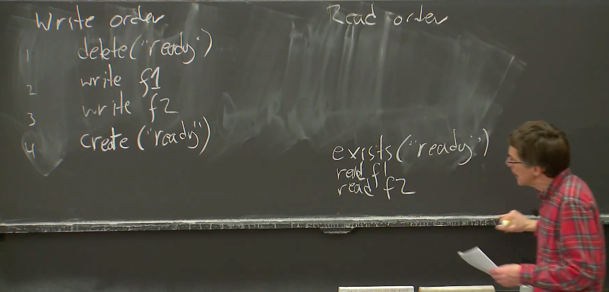

# Zookeeper

详解分布式系统Zookeeper：[https://mp.weixin.qq.com/s/DwyPt5YZgqE0O0HYEC1ZMQ]()

## 1. Zookeeper的线性一致性

### 1.1 Zookeeper对写请求的修改

对于raft来说，所有请求都需要通过leader节点，当系统节点个数达到一定程度时，leader会成为性能瓶颈，继续增加节点反而会增大leader的负载，从而降低系统整体性能。

为了改善这一问题，Zookeeper做了一些修改，使得read请求可以由非leader节点来处理，也就是客户端可以将read请求发送给任意一个副本来处理，在read请求占据较大比例时，zookeeper的性能会明显提高。

但这样也存在一个问题，因为非leader节点更新不一定及时，它未必总是有最新的数据，在read过程中它可能返回旧的数据。**可以说，为了提高read性能，zookeeper放弃了读请求的线性一致性，但它保持了写请求的线性一致性** 。

### 1.2 Zookeeper的FIFO客户端序列

这里的意思是，如果一个特定的客户端发送了一个写请求之后是一个读请求或者任意请求，那么首先，所有的写请求会以这个客户端发送的相对顺序，加入到所有客户端的写请求中。

所以，如果一个客户端说，先完成这个写操作，再完成另一个写操作，之后是第三个写操作，那么在最终整体的写请求的序列中，可以看到这个客户端的写请求以相同顺序出现（虽然可能不是相邻的）。所以，对于写请求，最终会以客户端确定的顺序执行。

在执行FIFO客户端序列中，有以下几种情况：

1. 对于写请求，因为都需要通过leader节点，所以保持顺序一致性很容易；

2. 对于读请求，由于它只会到达某个副本，所以读请求只能看到那个副本的Log对应的状态，如果一个客户端发起了两个读请求，第一个读请求在Log中的一个位置执行，那么第二个读请求只允许在第一个读请求对应的Log位置或者更后的位置执行。

3. 另外还需要注意一个问题，如果某个副本在执行读请求时故障，那么客户端会换另一个副本来执行。那另一个副本怎么知道哪一条log呢？ **在Zookeeper中，每个Log条目都会被Leader打上zxid的标签，这些标签就是Log对应的条目号。** 任何时候一个副本回复一个客户端的读请求，首先这个读请求是在Log的某个特定点执行的，其次回复里面会带上zxid，对应的就是Log中执行点的前一条Log条目号。为了保证FIFO，客户端会记住最高的zxid，当客户端发出一个请求到一个相同或者不同的副本时，它会在它的请求中带上这个最高的zxid。这样，其他的副本就知道，应该至少在Log中这个点或者之后执行这个读请求。

4. 更进一步，如果我发送一个写请求给Leader，在Leader commit这个请求之前需要消耗一些时间，所以我现在给Leader发了一个写请求，而Leader还没有处理完它，或者commit它。之后，我发送了一个读请求给某个副本。这个读请求需要暂缓一下，直到这个副本发现之前的写请求已经被执行了。
   
   具体应该怎么暂缓呢？举例来说，比如当客户端发送一个读请求说，我上一次发送给Leader的写请求对应了zxid是多少，这个副本必须等到自己看到对应zxid的写请求再执行读请求。

### 1.3 Zookeeper的同步操作

前文说过zookeeper的读操作不是线性一致的，为了弥补非严格线性一致的缺点，Zookeeper设计了sync这一同步操作。

sync本质上就是一个写请求。假设我知道你最近写了一些数据，并且我想读出你写入的数据，所以现在的场景是，我想读出Zookeeper中最新的数据。这个时候，我可以发送一个sync请求，它的效果相当于一个写请求。

所以它最终会出现在所有副本的Log中，尽管我只关心与我交互的副本，因为我需要从那个副本读出数据。接下来，在发送读请求时，我（客户端）告诉副本，在看到我上一次sync请求之前，不要返回我的读请求，这样读请求才能得到最新的数据。

sync的意义在于，如果我需要读最新的数据，我需要发送一个sync请求，之后再发送读请求。这个读请求可以保证看到sync对应的状态，所以可以合理的认为是最新的。但是同时也要认识到，这是一个代价很高的操作，因为我们现在将一个廉价的读操作转换成了一个耗费Leader时间的sync操作。所以，如果不是必须的，那还是不要这么做。

### 1.4 Zookeeper的就绪文件（ready file）

Zookeeper有一个Master节点，而Master节点在Zookeeper中维护了一个配置，这个配置对应了一些file（也就是znode，这里的file对应的就是论文里的znode，Zookeeper以文件目录的形式管理数据，所以每一个数据点也可以认为是一个file）。通过这个配置，描述了有关分布式系统的一些信息，例如所有worker的IP地址，或者当前谁是Master。该文件的更新必须是原子类型的更新，具体原因往下看。

假设现在Master在更新这个配置，同时，或许有大量的客户端需要读取相应的配置，并且需要发现配置的每一次变化。

首先是Master更新配置的过程：

1. 首先我们假设有一些Ready files，就是以Ready为名字的files。如果Ready file存在，那么允许读这个配置。如果Ready file不存在，那么说明配置正在更新过程中，我们不应该读取配置；
2. 如果Master要更新配置，那么第一件事情是删除Ready files。之后它会更新各个保存了配置的Zookeeper files（也就是znode），这里或许有很多的files。当所有组成配置的files都更新完成之后，Master会再次创建Ready file。
3. Master将这些操作同步到所有节点中。为了确保这里的执行顺序，Master以某种方式为这些请求打上了tag，表明了对于这些写请求期望的执行顺序。之后Zookeeper Leader需要按照这个顺序将这些写请求加到多副本的Log中。然后副本按照顺序执行。


左边的是发送给Leader的写请求，也就是更新ready file的过程，右边是某个副本与客户端交互的读请求。

那为什么这些要原子化操作呢？因为存在一种情况，客户端发现ready file存在并读取的过程中，ready file突然更新了，此时客户端读取到的f1是旧的，f2是新的，会造成错误。

**为了实现原子化的操作，在zookeeper中，客户端会发送exists请求来查询Ready file是否存在，另外还会建立一个针对这个Ready file的watch。这意味着如果Ready file有任何变更，例如被删除了，或者它之前不存在然后被创建了，副本会给客户端发送一个通知。**

接上一个例子，watch的引入意味着客户端在完成读所有的配置之前，如果客户端读的过程中，配置发生了新的更改，例如删除了ready file，客户端会收到Ready file删除的通知，就会放弃这次读再重新尝试一次。

## 1.5 Zookeeper线性一致性的总结

- Zookeeper基于（类似于）Raft框架，所以我们可以认为它是，当然它的确是容错的，它在发生网络分区的时候，也能有正确的行为。

- 当我们在分析各种Zookeeper的应用时，我们也需要记住Zookeeper有一些性能增强，使得读请求可以在任何副本被处理，因此，可能会返回旧数据。

- 另一方面，Zookeeper可以确保一次只处理一个写请求，并且所有的副本都能看到一致的写请求顺序。这样，所有副本的状态才能保证是一致的（写请求会改变状态，一致的写请求顺序可以保证状态一致）。

- 由一个客户端发出的所有读写请求会按照客户端发出的顺序执行。

- 一个特定客户端的连续请求，后来的请求总是能看到相比较于前一个请求相同或者更晚的状态（FIFO客户端序列）。

## 2. Zookeeper API

### 2.1 Zookeeper API的一些应用

<font color=#00ff>**Zookeeper的最宏观的应用是一个可以同时部署各种分布式服务的集群**。</font>

如果你有一个大的数据中心，并且在数据中心内运行各种东西，比如说Web服务器，存储系统，MapReduce等等。你或许会想要再运行一个包含了5个或者7个副本的Zookeeper集群，之后你可以部署各种各样的服务，并且让这些服务存储一些关键的状态到你的全局的Zookeeper集群中。

zookeeper可以部署这样一些服务：

- Zookeeper可以是一个VMware FT所需要的Test-and-Set服务的实现。Test-and-Set服务在发生主备切换时是必须存在的，但是里没有介绍。Zookeeper实际的为我们提供工具来写一个容错的，完全满足VMware FT要求的Test-and-Set服务，并且可以在网络分区时，仍然有正确的行为。这是Zookeeper的核心功能之一。

- 人们可以用zookeeper来发布其他服务器使用的配置信息。例如，向某些Worker节点发布当前Master的IP地址。

- zookeeper可以用来选举Master。当一个旧的Master节点故障时，哪怕说出现了网络分区，我们需要让所有的节点都认可同一个新的Master节点。

- zookeeper可以用于高可信度的存储。比如说GFS的Master需要存储对于一个特定的Chunk的Primary节点在哪，现在GFS的Master节点可以将其存储在Zookeeper中，当旧的Master崩溃了，一个新的Master被选出来替代旧的Master，这个新的Master可以直接从Zookeeper中读出旧Master的状态。

- 对于一个类似于MapReduce的系统，Worker节点可以通过在Zookeeper中创建小文件来注册自己。

- 同样还是类似于MapReduce这样的系统，你可以设想Master节点通过向Zookeeper写入具体的工作，之后Worker节点从Zookeeper中一个一个的取出工作，执行，完成之后再删除工作。

### 2.2 Zookeeper API的架构

**Zookeeper被设计成要被许多可能完全不相关的服务共享使用。** 所以我们需要一个命名系统来区分不同服务的信息，这样这些信息才不会弄混。对于每个使用Zookeeper的服务，围绕着文件，有很多很方便的方法来使用Zookeeper。

所以，Zookeeper的API看起来像是一个文件系统，它有一个层级化的目录结构，有一个根目录（root），之后每个应用程序有自己的子目录。比如说应用程序1将自己的文件保存在APP1目录下，应用程序2将自己的文件保存在APP2目录下，这些目录又可以包含文件和其他的目录。

但zookeeper又不是一个实际的文件系统，比如说你不能运行ls和cat这样的命令等等。这里只是在内部，以这种路径名的形式命名各种对象。假设应用程序2下面有X，Y，Z这些文件，当你通过RPC向Zookeeper请求数据时，你可以直接指定/APP2/X。这就是一种层级化的命名方式。

这里的文件和目录都被称为znodes。Zookeeper中包含了3种类型的znode：

- 第一种Regular znodes。这种znode一旦创建，就永久存在，除非你删除了它。

- 第二种是Ephemeral znodes。这种znode会与某个客户端绑定。如果Zookeeper认为创建它的客户端挂了，它会删除这种类型的znodes。客户端需要时不时的发送心跳给Zookeeper，告诉Zookeeper自己还活着，这样Zookeeper才不会删除客户端对应的ephemeral znodes。

- 最后一种类型是Sequential znodes。它的意思是，当你想要以特定的名字创建一个文件，Zookeeper实际上创建的文件名是你指定的文件名再加上一个数字。当有多个客户端同时创建Sequential文件时，Zookeeper会确保这里的数字不重合，同时也会确保这里的数字总是递增的。

注意，**这里面的所有znode文件都是有version的，每更新一次，version值就会加一**，如果客户端读取某个数据，再写入时发现和读时的version不一样了，那就说明这个数据在读和写的过程中被另一个客户端更新了。

<font color=#00ff>**zookeeper集群中有多台server，每台server中都存储着一个这样一个类似文件系统的数据模型，并保持着同步更新。** </font>另外，zookeeper的数据全部储存在内存中。

### 2.3 用zookeeper设计一个计数器

设计一个计数器，记录zookeeper被客户端访问的次数：

数据X代表当前访问的次数，V代表记录X的znode的version。基本思路是get X，然后再写入X + 1，但问题是：

- 读取的X未必是最新的；
- 这一操作不是原子化的，一读一写的过程中X可能被其它客户端更新。

我们首先将整个操作放在一个无限循环中。我们GETDATA获得一个数值X，和一个版本号V，可能不是最新的，也可能是新的。

之后，我们对于SETDATA("f", X + 1, V)加一个IF判断。如果V是一致的，那么中间X没有被leader中可能存在的最新的值更新，也没有被其它客户端修改，而是被我们原子化的修改了，返回true，那么我们会从循环中跳出 break，如果返回false，那我们会回到循环的最开始，重新执行，直到完成一次最新值的原子化更新为止。伪代码如下：

```
WHILE TRUE:
    X, V = GETDATA("F")
    IF SETDATA("f", X + 1, V):
        BREAK
```

### 2.4 zookeeper实现非扩展锁

对于锁来说，常见的操作是Aquire Lock，获得锁。获得锁可以用下面的伪代码实现：

```
WHILE TRUE:
    IF CREATE("f", data, ephemeral=TRUE): RETURN
    IF EXIST("f", watch=TRUE):
        WAIT
```

该代码的逻辑借鉴了ready file读取的过程（1.4）：

- 首先尝试创建锁文件，如果没有客户端拿锁，那么该文件不存在，我创建成功；
- 如果已经被别的客户端拿到锁了，那么我创建失败，接下来监听该文件是否存在(watch=TRUE)，如果占据锁的客户端释放了锁，也就是锁文件被删除了，zookeeper会发通知给我，结束等待，重新申请创建新的锁文件；
- 不断循环直到成功创建锁文件为止。

另外注意，我们这里创建的znode是临时类型（ephemeral）的znode，用于zookeeper集群与某个客户端联系。

### 2.5 zookeeper实现扩展锁

2.4 中的非扩展锁存在一个问题，也就是“羊群效应”，假如有1000个客户端在尝试获取锁，当持有锁的客户端释放锁后，其它几百个客户端会同时争夺这个锁，因此获取锁的复杂度为O(n)，而非扩展锁让该操作的复杂度降为O(1)，通过排队获取锁的方法，这样就不会出现所有客户端争夺一个锁的情况了。

在这个设计中，我们不再使用一个单独的锁文件，而是创建Sequential文件。

```
CREATE("f", data, sequential=TRUE, ephemeral=TRUE)
WHILE TRUE:
    LIST("f*")
    IF NO LOWER #FILE: RETURN
    IF EXIST(NEXT LOWER #FILE, watch=TRUE):
        WAIT
```

- 在代码的第1行调用CREATE，并指定sequential=TRUE，我们创建了一个Sequential文件，如果这是以“f”开头的第27个Sequential文件，这里实际会创建类似以“f27”为名字的文件。这里有两点需要注意，第一是通过CREATE，我们获得了一个全局唯一序列号（比如27），第二Zookeeper生成的序号必然是递增的；

- 代码第3行，通过LIST列出了所有以“f”开头的文件，也就是所有的Sequential文件；

- 代码第4行，如果现存的Sequential文件的序列号都不小于我们在代码第1行得到的序列号，那么表明我们在并发竞争中赢了，我们获得了锁，直接RETURN；当存在更低序列号的Sequential文件时，我们要做的是等待拥有更低序列号的客户端释放锁；

- 在代码的第5行，我们调用EXIST，并设置WATCH，等待比自己序列号更小的下一个锁文件删除。如果等到了，我们就是当前最小的序号锁文件，这代表着获取了锁，跳出循环。
